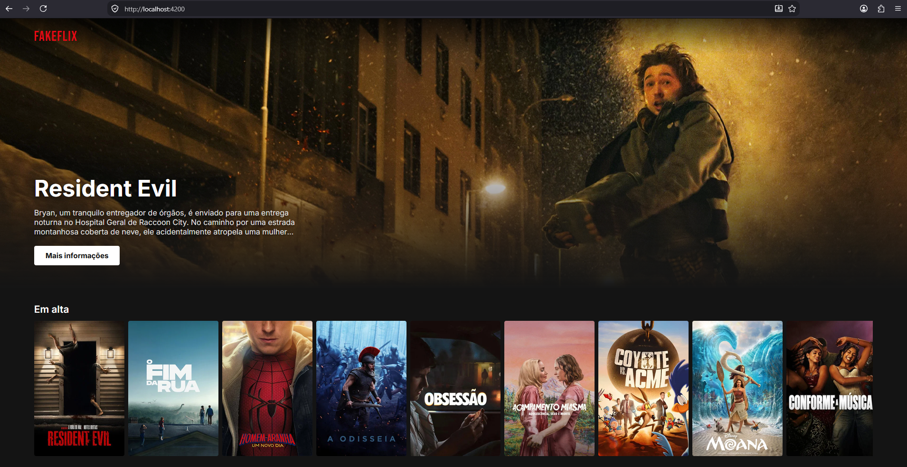
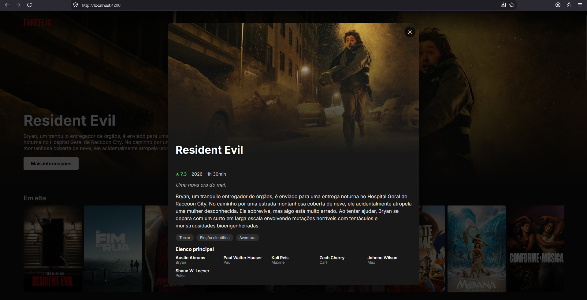

# FakeFlix — Catálogo

Projeto de portfólio inspirado na Netflix, feito em **Angular** (standalone components + signals), consumindo a API pública do **TMDB** (The Movie Database).




## O que tem

- Banner de destaque com o filme em alta da semana.
- Fileiras de filmes com rolagem horizontal (Em alta, Populares, Mais bem avaliados, e uma fileira por gênero).
- Clique em qualquer pôster abre um modal com informações detalhadas: sinopse, nota, duração, gêneros e elenco principal.
- Estados de carregamento e erro tratados na tela.

## Tecnologias

- Angular 21 (standalone components, `input()`/`output()`/`signal()`/`computed()`)
- SCSS
- HttpClient + RxJS para consumo da API do TMDB

## Como rodar

1. Instale as dependências:

   ```bash
   npm install
   ```

2. Crie o arquivo de configuração a partir do modelo:

   ```bash
   cp src/environments/environment.example.ts src/environments/environment.ts
   ```

   (no Windows/PowerShell: `Copy-Item src/environments/environment.example.ts src/environments/environment.ts`)

   Depois abra `src/environments/environment.ts` e troque `SEU_READ_ACCESS_TOKEN_AQUI` pelo seu **Read Access Token (v4 auth)** — um JWT longo — gerado em [themoviedb.org/settings/api](https://www.themoviedb.org/settings/api). Ele é enviado em cada requisição como header `Authorization: Bearer`.
   
   > O `environment.ts` está no `.gitignore` para que o token nunca seja commitado. Como este é um app front-end, o token vai embutido no bundle JavaScript quando o projeto é publicado — use sempre o token de **leitura** (`api_read`) e, se for fazer deploy público, considere gerar um token dedicado para isso.

3. Rode o projeto:

   ```bash
   npm start
   ```

   Acesse `http://localhost:4200`.

## Build de produção

```bash
npm run build
```

Os arquivos ficam em `dist/fakeflix-catalog/browser`, prontos para deploy em qualquer hosting estático (Vercel, Netlify, GitHub Pages, Firebase Hosting, etc).

> Nota: o inlining automático de Google Fonts no build de produção foi desativado (`optimization.fonts: false` no `angular.json`) porque depende de acesso de rede durante o build. As fontes continuam sendo carregadas normalmente pelo navegador em runtime, via as tags `<link>` no `index.html`.

## Estrutura

```
src/app/
├── core/
│   ├── models/movie.model.ts       # Interfaces (Movie, Genre, MovieDetails...)
│   └── services/tmdb.ts            # Integração com a API do TMDB
├── features/
│   ├── catalog/                    # Tela principal: hero + fileiras
│   │   ├── movie-row/              # Fileira horizontal de filmes
│   │   └── movie-card/             # Card de pôster individual
│   └── movie-detail/               # Modal de detalhes do filme
```
